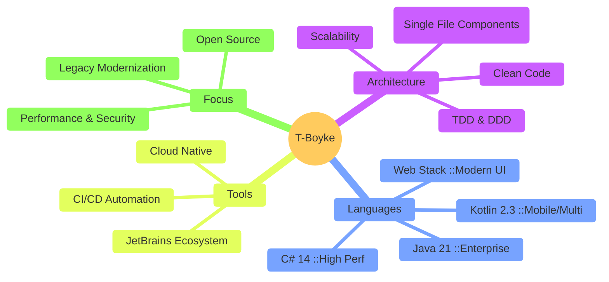

<div align="center">
  
  <br />
</div>
<div align="center">
  
<a href="https://git.io/typing-svg">
  
</a>

  <p>
    <a href="https://www.linkedin.com/in/YOUR-LINKEDIN-LINK">
      
    </a>
    <a href="mailto:t-boyke@example.com">
      
    </a>
    <a href="https://github.com/T-Boyke">
      
    </a>
  </p>

<p>
    
    
    
    
  </p>
</div>

---

<div align="center">

## 🚀 The Tech Arsenal

<div align="center">
  <a href="https://github.com/LelouchFR/skill-icons">
    
  </a>
  <br /><br />
  <table>
    <thead>
      <tr>
        <th align="left">Category</th>
        <th align="left">Technologies</th>
      </tr>
    </thead>
    <tbody>
      <tr>
        <td><strong>Backend & Core</strong></td>
        <td>C# 14, .NET 10, Java 21 (LTS), Kotlin 2.3, Ktor, Go 1.25, PHP 8.4, Bash</td>
      </tr>
      <tr>
        <td><strong>Frontend & Mobile</strong></td>
        <td>Angular 21, React 19, TypeScript 5.8, Blazor Hybrid, Jetpack Compose, PrimeReact</td>
      </tr>
      <tr>
        <td><strong>Styling & Design</strong></td>
        <td>TailwindCSS 4.0, UnoCSS, Material UI 6, HTML5, CSS3</td>
      </tr>
      <tr>
        <td><strong>Databases</strong></td>
        <td>PostgreSQL 18, MariaDB 11.4, DataGrip</td>
      </tr>
      <tr>
        <td><strong>DevOps & Cloud</strong></td>
        <td>Azure, GCP, Docker, Kubernetes 1.32, Linux (Arch, Fedora 43), GitHub Actions</td>
      </tr>
      <tr>
        <td><strong>Build & Tools</strong></td>
        <td>Gradle 9.1, CMake, NPM, Git, Grafana 11, Gitea, Jenkins</td>
      </tr>
      <tr>
        <td><strong>Testing & Quality</strong></td>
        <td>Playwright, Vitest, Lighthouse, ESLint, Prettier</td>
      </tr>
      <tr>
        <td><strong>IDEs</strong></td>
        <td>Visual Studio 2026, JetBrains All Products Pack (Rider, IntelliJ, ReSharper, GoLand, PhpStorm)</td>
      </tr>
      <tr>
        <td><strong>Creative & Misc</strong></td>
        <td>DaVinci Resolve, OBS Studio, Canva, LaTeX, Jira, Discord, Teams</td>
      </tr>
    </tbody>
  </table>
</div>

---

<div align="center">

## 🧠 Engineering Philosophy (2026 Edition)



</div>

---

<div align="center">

## 🏆 Notable Contributions

<table width="100%">
  <thead>
    <tr>
      <th width="45%">Project</th>
      <th width="20%">Role</th>
      <th width="35%">Tech Stack</th>
    </tr>
  </thead>
  <tbody>
    <tr>
      <td align="left">
        <a href="https://github.com/T-Boyke/vivi-music">
          <h3>🎵 VIVI Music</h3>
        </a>
        <blockquote>Next-Gen Android Music Experience</blockquote>
      </td>
      <td align="center"><strong>Maintainer</strong><br/>& Core Dev</td>
      <td align="left">
        
        
        
      </td>
    </tr>
    <tr>
      <td align="left">
        <a href="https://github.com/T-Boyke/C-Sharp-OOP-Fundamentals">
          <h3>🔷 C# OOP Core</h3>
        </a>
        <blockquote>Mastering Design Patterns & Architecture</blockquote>
      </td>
      <td align="center"><strong>Author</strong></td>
      <td align="left">
        
        
        
      </td>
    </tr>
    <tr>
      <td align="left">
        <a href="https://github.com/T-Boyke/grav-themes">
          <h3>🎨 Grav CMS Themes</h3>
        </a>
        <blockquote>Performance-first theming engine</blockquote>
      </td>
      <td align="center"><strong>Contributor</strong></td>
      <td align="left">
        
        
        
      </td>
    </tr>
    <tr>
      <td align="left">
        <a href="https://github.com/T-Boyke/cloud-utils">
          <h3>☁️ Enterprise Cloud Utils</h3>
        </a>
        <blockquote>Scalable Infrastructure as Code</blockquote>
      </td>
      <td align="center"><strong>Architect</strong></td>
      <td align="left">
        
        
        
      </td>
    </tr>
  </tbody>
</table>

</div>

<br/>
<i>Actively enabling the community through open source software.</i>
</div>

---

<div align="center">

## 📊 GitHub Analytics

<table>
  <tr>
    <td>
      
    </td>
    <td>
      
    </td>
  </tr>
</table>

<a href="https://git.io/streak-stats"></a>

</div>

---

## ⚡ Recent Activity

```bash
user@t-boyke-arch:~$ cat ~/current_status.log

[SYSTEM]: Online
[UPTIME]: 365 days, 24/7
[OS]:     Arch Linux (Hyprland) & Windows 11 Pro

> CURRENT_TASKS
  ├── 🔭 Architecting:  Next-Gen Enterprise Solutions (C# 14 / .NET 10)
  ├── 📱 Developing:    Cross-Platform Apps (Kotlin 2.3 / Ktor)
  ├── 🔨 Refactoring:   Legacy Delphi to Modern Microservices
  └── 🐧 Workflow:      Hybrid Power-User Setup

> LAST_LOGIN
  Today at 09:41 AM from IP 127.0.0.1
  **Workflow**: Hybrid power-user on **Windows 11** & **Arch Linux**.
```
---

<div align="center">
  
</div>
