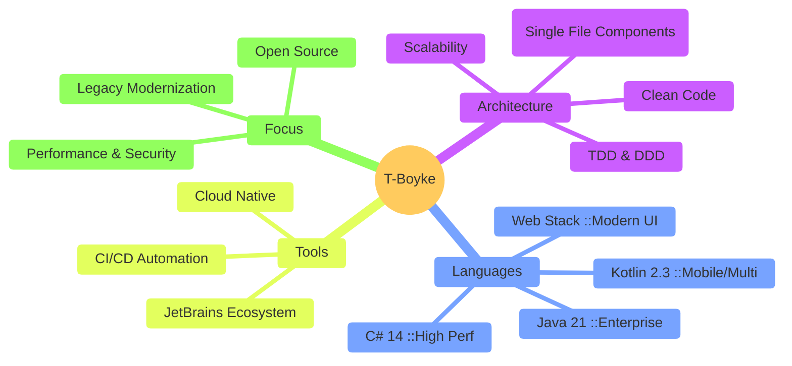

  
   

  
  

  

    
    
    
  

    
    
    
    
  

---

## 🚀 The Tech Arsenal

  

| Category | Technologies |
| :--- | :--- |
| **Backend & Core** | **C# 14**, **Java 21**, **Kotlin 2.3**, Delphi, Node.js, .NET 10 |
| **Frontend & Design** | Angular, Blazor, TailwindCSS, UnoCSS, Material UI, HTML5, CSS3 |
| **Databases** | MariaDB, Microsoft SQL Server |
| **DevOps & CI/CD** | GitHub Actions, Jenkins, Docker, Kubernetes, Gradle, NuGet, NPM |
| **Testing** | Playwright, Vitest, ESLint |
| **Tools & Creative** | JetBrains (Rider, IntelliJ, ReSharper), DaVinci Resolve, Canva, LaTeX |

---

## 🧠 Engineering Philosophy (2026 Edition)

---

## 🏆 Notable Contributions

| **Projekt** | **Rolle** | **Stack** |
| :--- | :--- | :--- |
| 🎵 **[VIVI Music](https://github.com/T-Boyke/vivi-music)** | Maintainer & Core Dev | **Kotlin**, Android, Material 3 |
| 🔷 **[C# OOP Fundamentals](https://github.com/T-Boyke/C-Sharp-OOP-Fundamentals)** | Author | **C#**, .NET, OOP Design Patterns |
| 🎨 **[Grav CMS Themes](https://github.com/T-Boyke/grav-themes)** | Contributor | **PHP**, Twig, SCSS, JavaScript |
| ☁️ **[Enterprise Cloud Utils](https://github.com/T-Boyke/cloud-utils)** | Architect | **C#**, Azure Functions, Terraform |

 
<i>Actively enabling the community through open source software.</i>

---

## 📊 GitHub Analytics

<table>
  <tr>
    <td>
      
    </td>
    <td>
      
    </td>
  </tr>
</table>

---

## ⚡ Recent Activity

<!--
  You can use a GitHub Action to automatically populate this section!
  Check out: https://github.com/jamesgeorge007/github-activity-readme
-->
* 🔭 **Architecting**: Next-Gen Enterprise Solutions in **C# 14**.
* 📱 **Developing**: Cross-Platform apps using **Kotlin 2.3**.
* 🔨 **Refactoring**: Bringing Legacy **Delphi** systems to the modern era.
* 🐧 **Workflow**: Hybrid power-user on **Windows 11** & **Arch Linux**.

---

  

